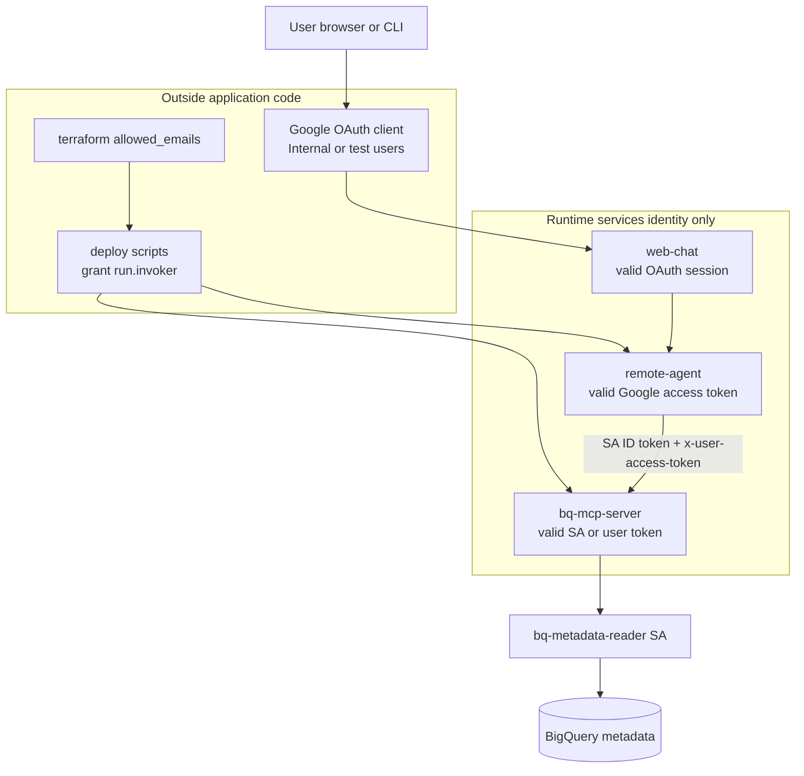
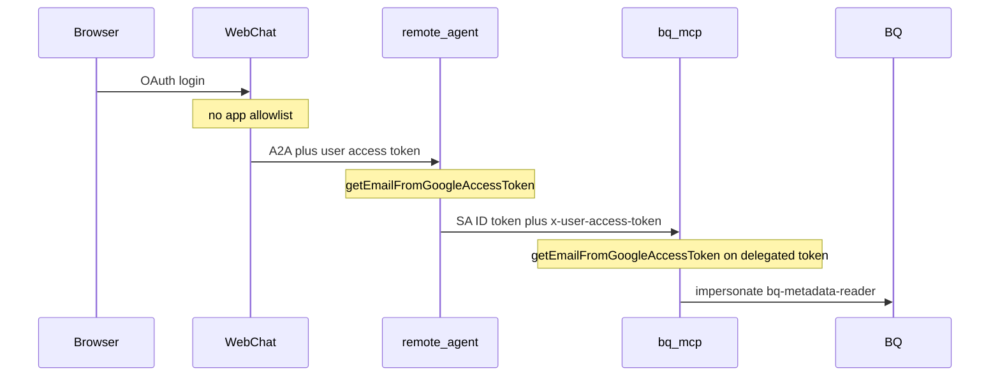
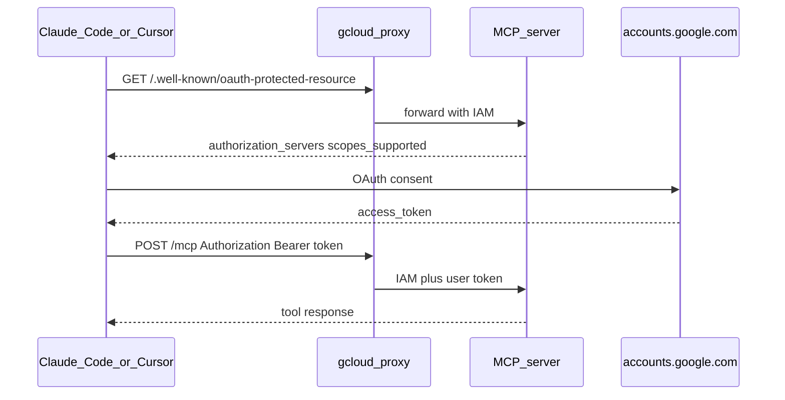

# Demo: Chain of Remote A2A Agent and MCP Servers

Secure integration demo: Google SSO web chat, private Cloud Run A2A agent and BigQuery MCP server, with **identity** (user OAuth) separated from **BigQuery access** (impersonated `bq-metadata-reader` service account).

## Packages

| Package                  | Purpose                                  |
| ------------------------ | ---------------------------------------- |
| `packages/mcp-auth`      | Shared Google OAuth auth and MCP helpers |
| `packages/bq-mcp-server` | BigQuery MCP server (`list_datasets`)    |
| `packages/remote-agent`  | ADK + A2A agent                          |
| `packages/agent-cli`     | CLI with delegated Google access token   |
| `packages/web-chat`      | Local Next.js chat UI (Google SSO)       |

## Operator quickstart

### 1. Terraform foundation

```bash
cd terraform
cp terraform.tfvars.example terraform.tfvars
terraform init && terraform apply
```

### 2. Deploy private Cloud Run services

Set `allowed_emails` in `terraform/terraform.tfvars`, then:

```bash
./scripts/deploy-mcp.sh
./scripts/deploy-agent.sh
```

### 3. Local web-chat

The web UI can compare **Agent (A2A)** vs **Direct tools via agent** (raw bq-mcp JSON returned by remote-agent without ADK). web-chat talks only to remote-agent over A2A in both modes.

**OAuth (required once):** Terraform’s IAP OAuth client does not support localhost redirect URIs. Create a **Desktop** (recommended) or **Web application** OAuth client:

```bash
./scripts/setup-web-oauth.sh
# set web_oauth_client_id (+ web_oauth_client_type) in terraform/terraform.tfvars, then:
terraform -chdir=terraform apply
```

Prerequisites: `gcloud auth login` and `gcloud auth application-default login` (Cloud Run IAM from the Next.js server).

```bash
./scripts/run-web-chat.sh
```

OAuth credentials come **only** from `terraform/terraform.tfvars` → `terraform apply` → process env. `packages/web-chat/.env.local` holds runtime config only (`AGENT_URL`, `OAUTH_REDIRECT_URI`).

Use `./scripts/run-web-chat.sh --sync-env` after deploy or `terraform apply` to refresh `AGENT_URL`. Open the app at `localhost:3000` (not `127.0.0.1`) so the redirect URI matches Google OAuth registration.

**Fully local** ([`run-local-dev.sh`](scripts/run-local-dev.sh)): remote-agent and bq-mcp run on localhost; set `AGENT_URL=http://127.0.0.1:8081` in `packages/web-chat/.env.local` manually.

Open `localhost:3000`, sign in with Google, and use the mode toggle to compare responses.

### Fully local (Google SSO + gcloud CLI)

```bash
cp .env.example .env   # optional: BQ_METADATA_READER_SA_EMAIL from terraform output
gcloud auth login
gcloud auth application-default login

./scripts/run-local-dev.sh
```

In another terminal:

```bash
export AGENT_URL=http://127.0.0.1:8081
./scripts/agent-cli.sh "List datasets in project ubie-yu-sandbox"
./scripts/agent-cli.sh "What Google account am I using and what credentials access BigQuery?"
```

Local stack uses `AUTH_MODE=google` on MCP and Google OAuth bearer tokens on the agent (no shared secrets). Vertex AI uses `GOOGLE_CLOUD_LOCATION=us-central1` and `AGENT_MODEL=gemini-2.5-flash` by default.

### Fully local (Docker Compose)

```bash
export BQ_METADATA_READER_SA_EMAIL="$(terraform -chdir=terraform output -raw bq_metadata_reader_sa_email)"
docker compose up
```

See [`terraform/README.md`](terraform/README.md) and [`.env.example`](.env.example) for configuration details.

## Authentication model

OAuth proves **identity** (valid Google user with consented scopes). **Authorization** — who may use this demo — is enforced **outside** application code:

| Layer                   | What it checks                                      | Where configured                                                                           |
| ----------------------- | --------------------------------------------------- | ------------------------------------------------------------------------------------------ |
| **Google OAuth client** | Who may sign in (Internal app or test users)        | GCP Console → Credentials                                                                  |
| **Cloud Run IAM**       | Who may invoke private service URLs (`run.invoker`) | [`terraform.tfvars`](terraform/terraform.tfvars.example) `allowed_emails` → deploy scripts |
| **Runtime services**    | Valid Google token / SA identity only               | No email allowlist in app env                                                              |

**Data plane** (separate from identity): `bq-mcp-server` impersonates `bq-metadata-reader` (Terraform SA with `roles/bigquery.metadataViewer`) for `list_datasets`. User OAuth is never sent to BigQuery.





**OAuth hardening:** Set the Web OAuth client to **Internal** (Google Workspace) or restrict **Test users** in GCP Console so only your org can complete browser login.

| Environment | Who impersonates bq-metadata-reader                     |
| ----------- | ------------------------------------------------------- |
| Cloud Run   | `bq-mcp-sa` (runtime service account)                   |
| Local       | Developer ADC (`gcloud auth application-default login`) |

Only **web-chat** runs a browser OAuth redirect flow; the agent and MCP validate tokens obtained elsewhere (gcloud, web-chat, or IDE MCP OAuth).

| Component           | OAuth callback?            | What to configure                                                                                                                                                                                                                                          |
| ------------------- | -------------------------- | ---------------------------------------------------------------------------------------------------------------------------------------------------------------------------------------------------------------------------------------------------------- |
| **web-chat**        | Yes — `/api/auth/callback` | `OAUTH_REDIRECT_URI` in `.env.local`; OAuth client from `terraform/terraform.tfvars` via `run-web-chat.sh` (must match [terraform output](terraform/README.md) `web_oauth_redirect_uris`)                                                                  |
| **IDE MCP clients** | Yes — IDE-specific URIs    | Register [terraform output](terraform/README.md) `mcp_oauth_redirect_uris` on a **Desktop** OAuth client. **Cursor:** [`/.cursor/mcp.json`](.cursor/mcp.json) with `${env:MCP_GOOGLE_OAUTH_CLIENT_ID}`. **Claude Code:** URL-only [`.mcp.json`](.mcp.json) |
| **remote-agent**    | No                         | `PUBLIC_AGENT_URL`, `MCP_RESOURCE_URL` (set by `deploy-agent.sh`), `BQ_METADATA_READER_SA_EMAIL` (identity in agent instruction; BigQuery SA label for demo)                                                                                               |
| **bq-mcp-server**   | No                         | `MCP_RESOURCE_URL`, `BQ_METADATA_READER_SA_EMAIL` (set by `deploy-mcp.sh`); PRM at `/.well-known/oauth-protected-resource`                                                                                                                                 |

After deploy, scripts set Cloud Run URLs automatically (use deploy output or `gcloud run services describe`, not placeholder URLs):

```bash
gcloud run services describe remote-agent --region=asia-northeast1 --format='value(status.url)'
gcloud run services describe bq-mcp --region=asia-northeast1 --format='value(status.url)'
```

### Use case A: Web app + CLI → remote-agent (A2A)

Web-chat and `agent-cli` talk to **remote-agent** over A2A. The agent forwards the user's Google token for identity; bq-mcp impersonates `bq-metadata-reader` for BigQuery.

**Multi-agent (same Cloud Run service):** `remote-agent` hosts multiple A2A agents under path prefixes (`/agents/bigquery`, `/agents/general`). Discover enabled agents via RFC 9727 API Catalog at `GET /.well-known/api-catalog` on the service root; each entry links to `{anchor}/agent-card.json`. The legacy BigQuery card remains at `/.well-known/agent-card.json` for backward compatibility. Web-chat loads the catalog, shows an agent card picker when remote A2A is enabled, and toggles availability via `GET/PATCH /agent-policy` (Google auth required). All agents start enabled at startup; runtime toggles are in-memory only and reset when remote-agent restarts.

**Local:** [`run-local-dev.sh`](scripts/run-local-dev.sh) — agent at `http://127.0.0.1:8081`, Google bearer on `Authorization`.

**Cloud Run:** [`run-cloud-check.sh`](scripts/run-cloud-check.sh) — Cloud Run identity token on `Authorization`, `gcloud auth print-access-token` on `X-Session-Authorization`.

**Web UI:** [`run-web-chat.sh`](scripts/run-web-chat.sh) — resolves OAuth + Cloud Run `AGENT_URL`, no proxy (server-side IAM via ADC).

```bash
# Local CLI
export AGENT_URL=http://127.0.0.1:8081
./scripts/agent-cli.sh "List datasets in project ubie-yu-sandbox"

# Cloud Run CLI (auto-resolves AGENT_URL via gcloud — do not copy placeholder URLs from docs)
./scripts/agent-cli.sh "List datasets in project ubie-yu-sandbox"
./scripts/agent-cli.sh "What Google account am I using and what credentials access BigQuery?"
# or: ./scripts/run-cloud-check.sh

# Web UI (Cloud Run agent, direct URL)
./scripts/run-web-chat.sh
```

### Use case B: Cursor / Claude Code → MCP

IDEs connect over MCP. Two endpoints:

- **bq-mcp** (`http://127.0.0.1:8080/mcp`) — direct BigQuery tools (`list_datasets`, `get_authenticated_user`)
- **remote-agent** (`http://127.0.0.1:8081/mcp`) — `chat` tool; ADK agent orchestrates bq-mcp internally

**Two auth layers (both required on Cloud Run):**

| Layer             | What it proves                         | How                                                                                                       |
| ----------------- | -------------------------------------- | --------------------------------------------------------------------------------------------------------- |
| **Cloud Run IAM** | Caller may reach private service       | `gcloud auth login` + [`proxy-mcp.sh`](scripts/proxy-mcp.sh) / [`proxy-agent.sh`](scripts/proxy-agent.sh) |
| **Google OAuth**  | Which Google user; BigQuery delegation | IDE OAuth prompt; token on `Authorization`                                                                |

The proxy alone is **not** a substitute for Google SSO.



**IDE config (by client):**

| IDE             | Config file                            | Client ID in git?                        | Scopes in config?    |
| --------------- | -------------------------------------- | ---------------------------------------- | -------------------- |
| **Cursor**      | [`.cursor/mcp.json`](.cursor/mcp.json) | No — `${env:MCP_GOOGLE_OAUTH_CLIENT_ID}` | No — from server PRM |
| **Claude Code** | [`.mcp.json`](.mcp.json)               | No                                       | No — from server PRM |

Google does **not** support MCP Dynamic Client Registration. **Cursor requires a pre-registered Desktop OAuth client ID** (via env var). Claude Code can connect with URL + `callbackPort` only.

**Cursor** — [`.cursor/mcp.json`](.cursor/mcp.json):

```json
{
  "mcpServers": {
    "bq-mcp": {
      "type": "http",
      "url": "http://127.0.0.1:8080/mcp",
      "oauth": {
        "clientId": "${env:MCP_GOOGLE_OAUTH_CLIENT_ID}",
        "callbackPort": 54321
      }
    },
    "remote-agent": {
      "type": "http",
      "url": "http://127.0.0.1:8081/mcp",
      "oauth": {
        "clientId": "${env:MCP_GOOGLE_OAUTH_CLIENT_ID}",
        "callbackPort": 54321
      }
    }
  }
}
```

Set env before starting Cursor (Desktop client ID is a public identifier, not a secret):

```bash
export MCP_GOOGLE_OAUTH_CLIENT_ID="YOUR_DESKTOP_CLIENT_ID.apps.googleusercontent.com"
# or: export MCP_GOOGLE_OAUTH_CLIENT_ID=$(terraform -chdir=terraform output -raw mcp_oauth_client_id)
```

**Claude Code** — [`.mcp.json`](.mcp.json) (URL + `callbackPort` only):

```json
{
  "mcpServers": {
    "bq-mcp": {
      "type": "http",
      "url": "http://127.0.0.1:8080/mcp",
      "oauth": { "callbackPort": 54321 }
    },
    "remote-agent": {
      "type": "http",
      "url": "http://127.0.0.1:8081/mcp",
      "oauth": { "callbackPort": 54321 }
    }
  }
}
```

Scopes are advertised by the server PRM (`/.well-known/oauth-protected-resource`), not in IDE config. Reference scopes: `openid`, `email`, `https://www.googleapis.com/auth/bigquery`.

**Operator one-time setup:**

1. Create a **Desktop** OAuth client in [GCP Console → Credentials](https://console.cloud.google.com/apis/credentials).
2. Register every URI from `terraform output mcp_oauth_redirect_uris` (see [terraform/README.md](terraform/README.md)).
3. Set `allowed_emails` in `terraform.tfvars` so deploy scripts grant `roles/run.invoker` on **bq-mcp** and **remote-agent**.

**Local:** Start stack with [`run-local-dev.sh`](scripts/run-local-dev.sh), then connect the IDE to the URLs in [`.mcp.json`](.mcp.json).

**Cloud Run:**

```bash
./scripts/proxy-mcp.sh    # terminal 1 → :8080
./scripts/proxy-agent.sh  # terminal 2 → :8081
```

| IDE            | Callback URI                                                    | GCP OAuth client type |
| -------------- | --------------------------------------------------------------- | --------------------- |
| Cursor IDE     | `cursor://anysphere.cursor-mcp/oauth/callback`                  | Desktop               |
| Claude Code    | `http://localhost:54321/callback` (use `--callback-port 54321`) | Desktop               |
| Claude Desktop | `https://claude.ai/api/mcp/auth_callback`                       | Web                   |
| Codex Desktop  | `codex://connector/oauth_callback`                              | Desktop               |
| Codex CLI      | _(not applicable — OpenAI sign-in at `localhost:1455`)_         | —                     |

**Claude Code CLI** (alternative to checked-in `.mcp.json`):

```bash
claude mcp add bq-mcp http://127.0.0.1:8080/mcp \
  --transport http \
  --callback-port $(cd terraform && terraform output -raw claude_code_oauth_callback_port)

claude mcp add remote-agent http://127.0.0.1:8081/mcp \
  --transport http \
  --callback-port $(cd terraform && terraform output -raw claude_code_oauth_callback_port)
```

Use the IDE's Google OAuth flow when prompted.

### Troubleshooting (Cursor MCP logs)

| Log message                                                                      | Fix                                                                                                                                                    |
| -------------------------------------------------------------------------------- | ------------------------------------------------------------------------------------------------------------------------------------------------------ |
| `does not support dynamic client registration`                                   | Set `MCP_GOOGLE_OAUTH_CLIENT_ID` and use [`.cursor/mcp.json`](.cursor/mcp.json) with `oauth.clientId`                                                  |
| `Protected resource https://127.0.0.1:8080/mcp does not match expected http://…` | Redeploy bq-mcp/remote-agent, restart `./scripts/proxy-mcp.sh`; PRM must return `http://127.0.0.1:8080/mcp` (loopback always uses `http`, not `https`) |
| Connection refused on `:8080`                                                    | Run `./scripts/proxy-mcp.sh` (and `./scripts/proxy-agent.sh` for remote-agent)                                                                         |

**Optional: Cursor `auth.CLIENT_ID` fallback**

If `oauth.clientId` env interpolation fails in your Cursor version, use the legacy `auth` block (same env var; scopes still optional if PRM works):

```json
{
  "mcpServers": {
    "bq-mcp": {
      "url": "http://127.0.0.1:8080/mcp",
      "auth": {
        "CLIENT_ID": "${env:MCP_GOOGLE_OAUTH_CLIENT_ID}",
        "scopes": ["openid", "email", "https://www.googleapis.com/auth/bigquery"]
      }
    }
  }
}
```

Verify PRM discovery (through proxy):

```bash
curl -s http://127.0.0.1:8080/.well-known/oauth-protected-resource | jq '{resource, scopes_supported}'
curl -s http://127.0.0.1:8081/.well-known/oauth-protected-resource | jq '{resource, scopes_supported}'
# resource should be http://127.0.0.1:8080/mcp (not *.run.app) when proxied
# authorization_servers: ["https://accounts.google.com"]
```

### Deploy and smoke test

```bash
./scripts/deploy-cloud.sh
./scripts/run-cloud-check.sh
```

Both Cloud Run services are private (`--no-allow-unauthenticated`) with min/max instances = 1.

## Getting Started

### Prerequisites

- [pnpm](https://pnpm.io/)
- Node.js (see `.node-version`)

Linting and formatting use [Trunk](https://trunk.io/) (ESLint, Prettier, and more). The Trunk **launcher** is installed with project dependencies—you do not need a separate Trunk install for the default workflow.

### Installation

```bash
pnpm install
```

Optional: prefetch Trunk’s hermetic tools (helpful for offline work or CI images):

```bash
pnpm exec trunk install
```

If you prefer a global `trunk` on your PATH, see the [Trunk installation guide](https://docs.trunk.io/code-quality/overview/getting-started/install) (e.g. `brew install trunk-io` on macOS).

### Supply-chain protections

The template uses **pnpm 11** with settings in [`pnpm-workspace.yaml`](pnpm-workspace.yaml): a **7-day** [`minimumReleaseAge`](https://pnpm.io/settings#minimumreleaseage) (10080 minutes, stricter than pnpm’s default 1 day), [`blockExoticSubdeps`](https://pnpm.io/settings#blockexoticsubdeps) enabled, and an [`allowBuilds`](https://pnpm.io/settings#allowbuilds) map for dependencies that must run install scripts (pnpm 11 requires this for native toolchain packages such as esbuild). See the [pnpm 11 release notes](https://pnpm.io/blog/releases/11.0).

### Development

```bash
pnpm dev
```

### Build

```bash
pnpm build
```

### Linting & Formatting

```bash
pnpm lint
pnpm format
```

## Project Structure

- `packages/`: Monorepo packages
  - `mcp-auth/`: Auth SDK
  - `bq-mcp-server/`: BigQuery MCP server
  - `remote-agent/`: A2A + ADK agent
  - `agent-client/`: Shared A2A agent client
  - `agent-cli/`: CLI for the agent (`GOOGLE_ACCESS_TOKEN` via `scripts/agent-cli.sh`)
  - `web-chat/`: Local chat web app
  - `common/`: Shared utilities (template)
- `terraform/`: GCP foundation (SAs, Artifact Registry, OAuth)
- `scripts/`: Cloud Run deploy and local IAM proxies (`cloud-run-local-proxy.mjs` via `proxy-mcp.sh` / `proxy-agent.sh`)

## License

{LICENSE}
