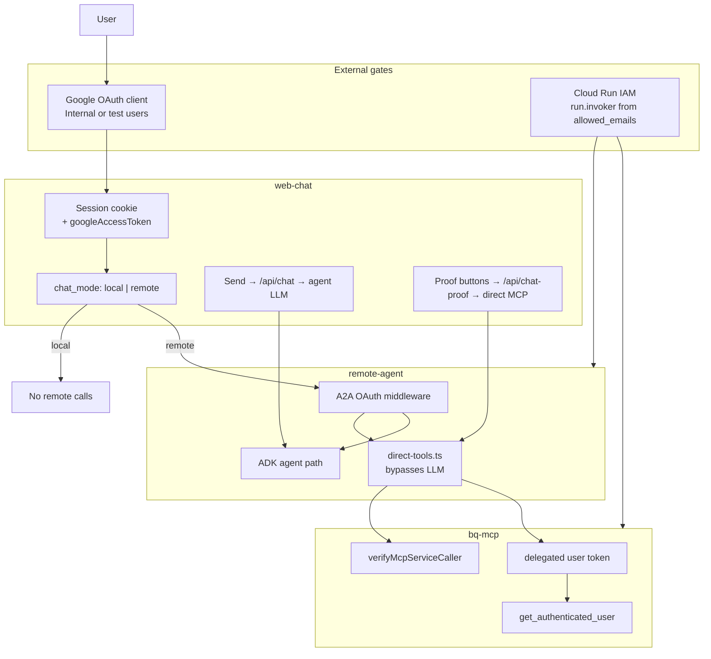
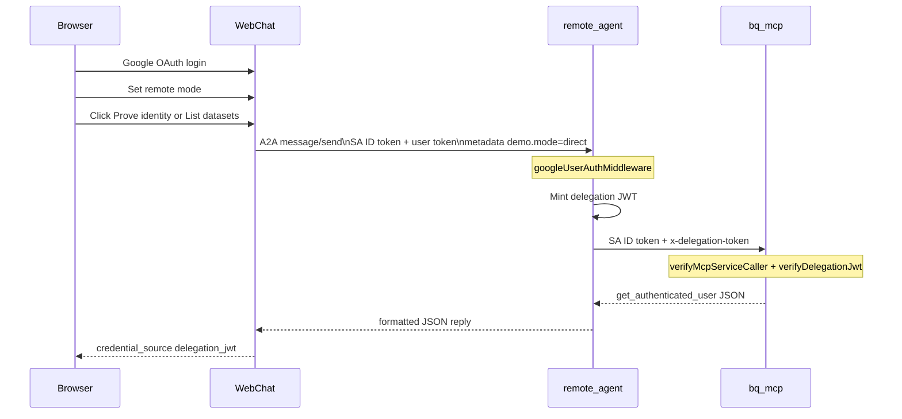

# Auth proof playbook

Demonstrate that **web-chat** is the controlled human entry point and that identity flows through **OAuth + Cloud Run IAM + token delegation** to `remote-agent` (A2A) and `bq-mcp` (MCP).

## Architecture





### Enterprise wording (this repo)

| Term               | What it means here                                                                                                         |
| ------------------ | -------------------------------------------------------------------------------------------------------------------------- |
| **Google SSO**     | Browser OAuth to web-chat; runtime validation via `getTokenInfo` at agent/MCP                                              |
| **Cloud Run IAM**  | `allowed_emails` → `run.invoker` (network gate)                                                                            |
| **A2A with OAuth** | User token on `X-Session-Authorization` (Cloud Run) or `Authorization` (local)                                             |
| **MCP with OAuth** | PRM + user identity at MCP; agent path uses hop token exchange (`x-delegation-token`); IDE direct path passes Google token |
| **IAP**            | Terraform provisions IAP brand/client for legacy setup; **runtime protection is IAM + OAuth**, not IAP JWT on each hop     |

## Positive proofs (web UI)

The demo console uses a **control plane (left)** and **operation plane (right)**. The operation plane shows an **Auth trace** strip after each request or probe.

**Send vs auth proof:** **Send** always uses the LLM agent path (`POST /api/chat`). **Prove identity** and **List datasets** use the direct MCP JSON path (`POST /api/chat-proof`) without an LLM. There is no user-facing Agent/Direct mode toggle — the route picks the path.

**Auth profile** (remote mode): toggles apply to **Prove identity** and **List datasets**; **Send** requires **Full**. Proof buttons stay available even when `agent-policy` returns 403 — fix IAM via `gcloud auth application-default login` and `allowed_emails` for Full Send. **Run probe** checks `GET /agent-policy` only.

Negative curl scenarios are also listed under **Negative checks (terminal)** in the control plane.

Prerequisites: `./scripts/run-web-chat.sh`, sign in with Google.

| Step | UI settings        | Action                                                                       | Expected                                                                   |
| ---- | ------------------ | ---------------------------------------------------------------------------- | -------------------------------------------------------------------------- |
| 1    | Default (local)    | Send any message                                                             | Reply from local web-chat agent; no remote-agent call                      |
| 2    | Remote + Full auth | Send: _What Google account am I using and what credentials access BigQuery?_ | Natural-language answer; auth trace MCP shows hop exchange when configured |
| 3    | Remote + Full auth | Click **Prove identity**                                                     | JSON with `credential_source: delegation_jwt` and your email               |
| 4    | Remote + Full auth | Click **List datasets**                                                      | JSON with `status` and `bigquery_service_account`                          |

Proof buttons bypass the LLM and return raw `bq-mcp` JSON via `remote-agent` → proves delegation end-to-end.

## Negative proofs (manual curl)

Resolve your agent URL:

```bash
AGENT_URL="$(gcloud run services describe remote-agent \
  --project=YOUR_PROJECT --region=asia-northeast1 --format='value(status.url)')"
```

### 1. No auth — proves Cloud Run IAM gate

```bash
curl -s -o /dev/null -w "%{http_code}\n" "${AGENT_URL}/.well-known/api-catalog"
```

Expected: **403** (caller lacks `run.invoker` / no identity token).

### 2. IAM token only, no user OAuth — proves A2A OAuth layer

```bash
ID_TOKEN="$(gcloud auth print-identity-token --audiences="${AGENT_URL}")"
curl -s -o /dev/null -w "%{http_code}\n" \
  -H "Authorization: Bearer ${ID_TOKEN}" \
  "${AGENT_URL}/agent-policy"
```

Expected: **401** or **403** (missing delegated user access token).

### 3. Signed out web session — proves web-chat session gate

```bash
curl -s -o /dev/null -w "%{http_code}\n" \
  -X POST http://localhost:3000/api/chat \
  -H "Content-Type: application/json" \
  -d '{"message":"hello"}'
```

Expected: **401** (no session cookie).

## Results matrix

| Step                           | Expected status / outcome  | What it proves                     |
| ------------------------------ | -------------------------- | ---------------------------------- |
| Web local mode                 | Local reply                | Remote stack not used              |
| Web remote + agent             | LLM answer with your email | Full A2A + delegation chain        |
| Web remote + direct identity   | JSON `delegation_jwt`      | Hop token exchange agent to bq-mcp |
| Web remote + direct datasets   | JSON with SA field         | BigQuery impersonation path        |
| curl no auth                   | 403                        | Cloud Run IAM                      |
| curl IAM only                  | 401/403                    | A2A OAuth middleware               |
| curl no session                | 401                        | Web session gate                   |
| `./scripts/run-cloud-check.sh` | Smokes pass + IAM negative | Automated regression               |

## Automated check

```bash
./scripts/run-cloud-check.sh
```

Runs two happy-path agent-cli smokes plus an unauthenticated curl that must **not** return 200.

## Local development

Set the same `DELEGATION_JWT_SECRET` on **remote-agent** and **bq-mcp-server** when running locally with `AUTH_MODE=cloud` (or rely on Google-token passthrough when the secret is unset and `AUTH_MODE=google`). Deploy scripts generate `.delegation-jwt-secret` at the repo root on first Cloud Run deploy.
