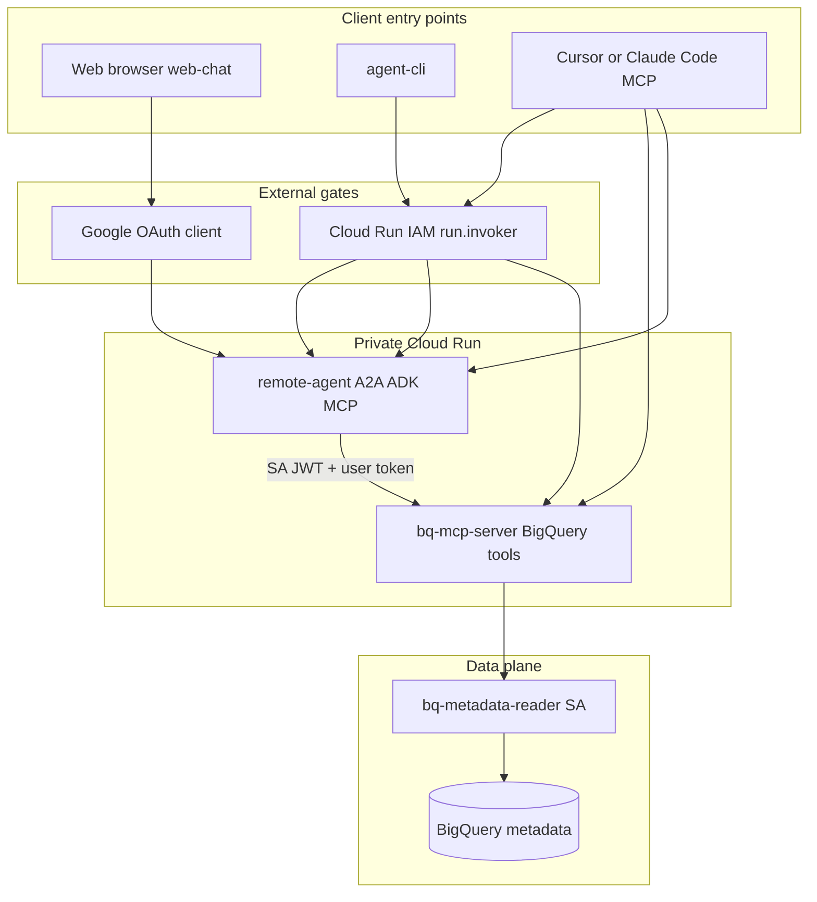
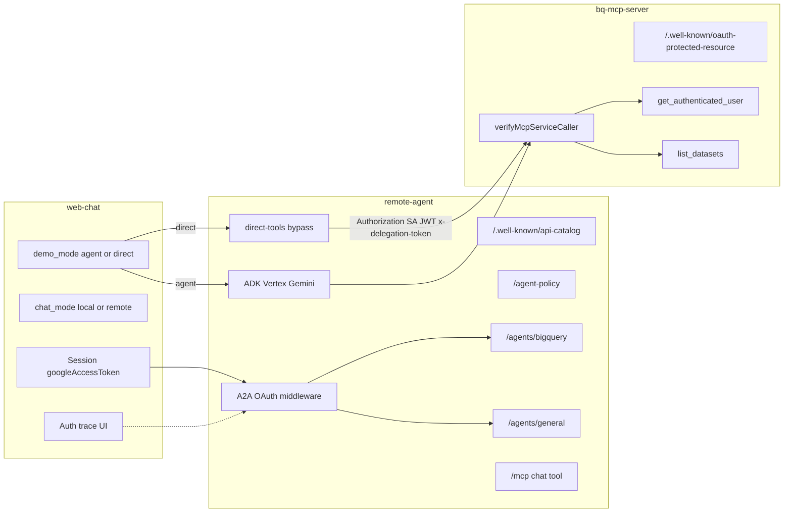
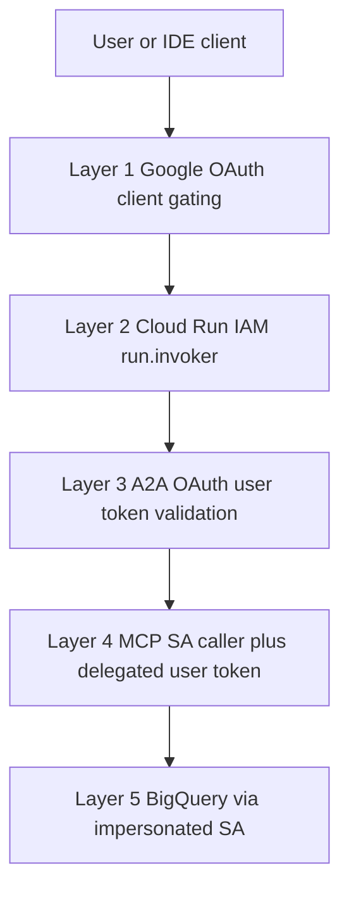
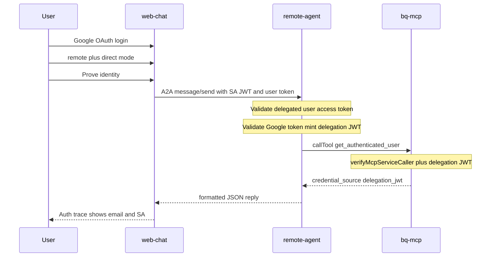
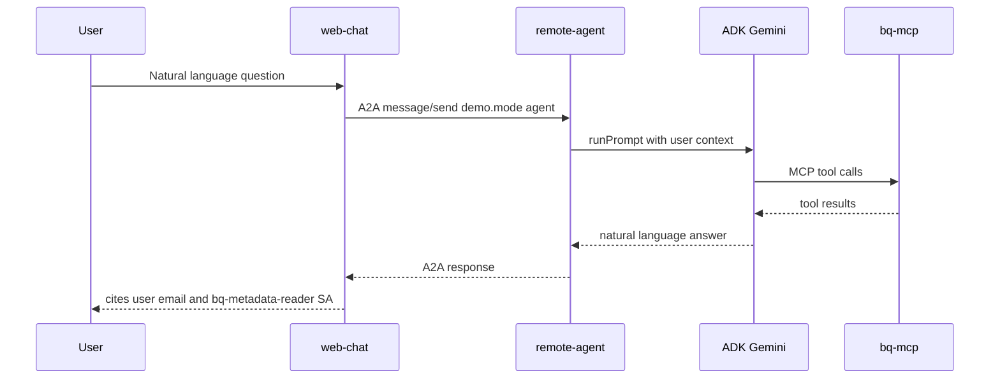
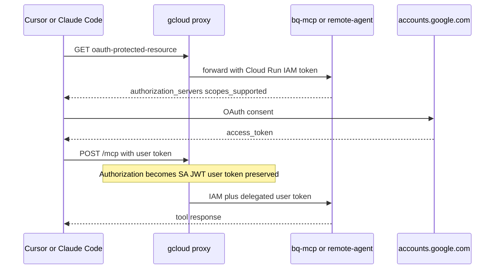
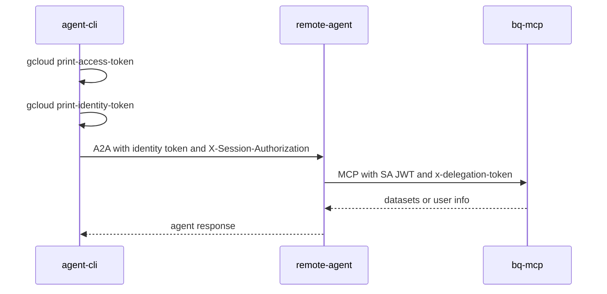

# リモート A2A エージェントと MCP サーバ連携 — 実証レポート

## 概要

本レポートは、**プライベート Cloud Run 上の A2A エージェント**（`remote-agent`）と **BigQuery MCP サーバ**（`bq-mcp-server`）を連携させ、**ユーザー本人確認**（Google OAuth アクセストークン）と **BigQuery データアクセス**（`bq-metadata-reader` サービスアカウントのなりすまし）を分離したデモンストレーションの実証内容を記述する。マルチホップのトークン委譲、多層セキュリティ（OAuth クライアント制限、Cloud Run IAM、アプリケーション OAuth）、標準プロトコル（A2A、MCP OAuth PRM、RFC 9727 API カタログ）が、再現可能かつ fail-closed なアーキテクチャとして成立することを示す。クライアントはブラウザ Web チャット、CLI、IDE MCP クライアント（Cursor、Claude Code）を含む。

---

## 1. 実証クレーム

本デモは以下の仮説を検証する。

1. **MCP 直接アクセスなしの A2A オーケストレーション** — クライアントはリモート A2A エージェント経由でのみ BigQuery MCP ツールに到達できる。Web チャットは MCP サーバを直接呼び出さない。
2. **本人確認とデータアクセスの分離** — ユーザーの OAuth アクセストークンは _誰であるか_ を証明する。BigQuery メタデータ読み取りはなりすまし SA（`bq-metadata-reader`）を使用し、ユーザーの資格情報を BigQuery API に送信しない。
3. **合成可能なセキュリティレイヤ** — Cloud Run IAM（`run.invoker`）とアプリケーション層の Google OAuth 検証は独立したゲートとして機能する。一方を満たしても他方をバイパスできない。
4. **マルチホップのトークン委譲** — ユーザーアクセストークンは、Cloud Run 身份 JWT とは別の委譲ヘッダを用いてエージェント → MCP のホップを越えて伝播する。
5. **MCP OAuth ディスカバリ** — IDE クライアントは Protected Resource Metadata（PRM）で認可要件を発見する。Google は動的クライアント登録をサポートせず、事前登録 OAuth クライアントが必要。
6. **マルチエージェントディスカバリ** — 1 つの Cloud Run サービス上の複数 A2A エージェントは、`/.well-known/api-catalog` の RFC 9727 API カタログで発見できる。
7. **Fail-closed 動作** — ネガティブテストにより、必要な資格情報が欠落した場合に各レイヤが拒否することを確認する。

---

## 2. システムコンテキスト

### 2.1 コンポーネント

| コンポーネント    | 役割                                                                                                                                             |
| ----------------- | ------------------------------------------------------------------------------------------------------------------------------------------------ |
| **web-chat**      | ローカル Next.js チャット UI。ブラウザ Google OAuth を実行し、セッションとアクセストークンを保持、`remote-agent` へ A2A メッセージを送信。       |
| **remote-agent**  | ADK エージェント、A2A JSON-RPC エンドポイント、オプションの MCP `/mcp` chat ツール、実証用 direct-tool バイパスをホストする Cloud Run サービス。 |
| **bq-mcp-server** | `get_authenticated_user` と `list_datasets` BigQuery ツールを公開する Cloud Run MCP サーバ。                                                     |
| **mcp-auth**      | 共有ライブラリ：OAuth ミドルウェア、MCP 認可ハンドラ、PRM ルート、トークン委譲、Cloud Run 身份トークン取得。                                     |
| **agent-client**  | 共有 A2A クライアント：エージェントカード解決、API カタログディスカバリ、Cloud Run デュアルヘッダ fetch。                                        |
| **agent-cli**     | gcloud 由来トークンで A2A メッセージを送信する CLI クライアント。                                                                                |

### 2.2 デプロイメントトポロジ

**Cloud Run（本番デモ）：**

- `remote-agent` と `bq-mcp-server` は **プライベート** Cloud Run サービスとしてデプロイ（`--no-allow-unauthenticated`）。
- Terraform の `allowed_emails` により、デプロイ時に指定ユーザーへ `roles/run.invoker` を付与。
- Web チャットは **ローカル** で実行（Cloud Run 上ではない）。サーバ側で Application Default Credentials により Cloud Run 身份トークンを取得。
- IDE MCP クライアントは、Cloud Run IAM トークンを注入する **ローカル gcloud プロキシ**（ポート 8080：MCP、8081：エージェント）経由で接続。

**ローカル開発：**

- 全サービスを localhost で実行（`127.0.0.1:8080` MCP、`127.0.0.1:8081` エージェント、`localhost:3000` Web チャット）。
- `AUTH_MODE=google`：`Authorization` にユーザーベアラートークン（Cloud Run 身份 JWT なし）。

### 2.3 チェーンルール

```text
web-chat → remote-agent (A2A) → bq-mcp-server (MCP)
```

Web チャットは **bq-mcp-server を直接呼び出さない**。IDE クライアントはどちらのエンドポイントにも接続可能だが、Web デモのチェーンは常にエージェント経由。

---

## 3. アーキテクチャ図

### 3.1 概要アーキテクチャ

クライアント入口、外部ゲート、プライベート Cloud Run ランタイム、BigQuery データプレーンの高レベル図。



### 3.2 詳細システム図

ルート、モード、認証タッチポイントを含むコンポーネントレベルの図。



### 3.3 セキュリティレイヤ

Web チャットの **Auth trace** ストリップ（Session → IAM → A2A OAuth → MCP 委譲 → BigQuery SA）に対応。



---

## 4. 技術プライマ

各節で標準を定義し、本デモでの適用方法を説明する。

### 4.1 A2A（Agent-to-Agent プロトコル）

[A2A プロトコル仕様](https://a2a-protocol.org/latest/specification/)は、独立した AI エージェントシステム間の通信を標準化するオープン規格。A2A は MCP を補完する：MCP はエージェントとツール・リソースを接続し、A2A はエージェント同士をタスク委譲と協調のために接続する。[A2A 概要（A2A と MCP）](https://a2a-protocol.org/dev/)および [Google Developers Blog 発表](https://developers.googleblog.com/en/a2a-a-new-era-of-agent-interoperability/)を参照。

主要概念：

- **Agent Card** — エージェントの能力、URL、セキュリティ要件を記述する JSON。`{base}/agent-card.json` またはレガシー `/.well-known/agent-card.json` で提供。
- **message/send** — ユーザーメッセージを送信し応答を受け取る JSON-RPC 操作。
- **プロトコルバージョン** — 本デモは [`@a2a-js/sdk`](https://github.com/a2aproject/a2a-js) により A2A **0.3.0** を使用。

**本デモでの適用：**

- `remote-agent` は 2 エージェントをホスト：`bigquery`（`/agents/bigquery`）、`general`（`/agents/general`）。
- エージェントカードは Google を認可サーバとする OpenID Connect セキュリティを宣言。
- クライアントは `GET /.well-known/api-catalog`（RFC 9727）でエージェントを発見し、`{anchor}/agent-card.json` を取得。
- Web チャットと CLI は `A2AClient.fromCardUrl(...)` の後 `sendMessage` を呼び出し、デモモード用メタデータを付与可能。

### 4.2 OAuth 付き A2A（アプリケーション層）

A2A 自体は Agent Card にセキュリティスキーム（OpenID Connect 等）を定義する。本デモは A2A ハンドラ実行前に **アプリケーション層 OAuth ゲート** を追加：ミドルウェアが保護ルートごとに委譲 Google **アクセストークン** を検証する。

**本デモでの適用：**

- ミドルウェアは次の順でユーザートークンを解決：
  1. `x-user-access-token` ヘッダ
  2. `X-Session-Authorization: Bearer <token>`（Cloud Run デュアルヘッダ）
  3. `Authorization: Bearer <token>`（ローカル開発のみ；JWT 形状の身份トークンは除外）
- Google トークン情報 API でアクセストークンとメールアドレスを検証。
- トークン欠落 → **401** `{ "error": "Missing Google access token" }`
- 無効トークン → **403** `{ "error": "Forbidden" }`

### 4.3 MCP（Model Context Protocol）

[MCP 仕様](https://modelcontextprotocol.io/specification/2025-06-18/basic)は AI アプリケーションとツール・リソース・プロンプトの接続を標準化する。MCP サーバは **tools** を HTTP（本デモでは streamable HTTP トランスポート）経由で公開。

**本デモでの適用：**

- `bq-mcp-server` の 2 ツール：
  - `get_authenticated_user` — 委譲ユーザートークンから本人情報と BigQuery 用 SA を返す。
  - `list_datasets` — なりすまし `bq-metadata-reader` 資格情報で GCP プロジェクトのデータセット一覧。
- `remote-agent` は `/mcp` に ADK エージェントを内部オーケストレーションする `chat` ツールも公開。
- direct tool 実行時および ADK がツール呼び出し時、`remote-agent` は MCP **クライアント** として `bq-mcp-server` を呼ぶ。

### 4.4 OAuth 付き MCP（Protected Resource Metadata）

[MCP Authorization](https://modelcontextprotocol.io/specification/2025-06-18/basic/authorization) は [RFC 9728 OAuth 2.0 Protected Resource Metadata](https://datatracker.ietf.org/doc/html/rfc9728) の実装を要求。クライアントはトークン取得前に認可サーバとスコープを PRM で発見する。

本デモで使用する PRM フィールド：

```json
{
  "resource": "https://example.run.app/mcp",
  "authorization_servers": ["https://accounts.google.com"],
  "scopes_supported": ["openid", "email", "https://www.googleapis.com/auth/bigquery"]
}
```

`GET /.well-known/oauth-protected-resource` で提供。ローカルプロキシ時は `http://127.0.0.1:8080/mcp`（ループバックは HTTP）。

**本デモでの適用：**

- 両 MCP サーバが共有 `mcp-auth` により PRM ルートをマウント。
- IDE クライアント（Cursor、Claude Code）は PRM 取得 → Google OAuth → MCP リクエストにアクセストークン付与。
- **Google は MCP 動的クライアント登録をサポートしない。** Cursor は環境変数で事前登録 Desktop OAuth クライアント ID が必要。Claude Code は URL と callback ポートのみで接続可能。

cloud モードでは `verifyMcpServiceCaller` を追加：`Authorization` に Cloud Run **身份 JWT**（`run.invoker` 権限を持つ呼び出し元）が必要。エージェント経由ではユーザー身份は `x-delegation-token` の短命委譲 JWT で送る。

### 4.5 トークン委譲とホップトークン交換

**クライアント → エージェント（トークン委譲）：** ユーザーの Google OAuth アクセストークンを `X-Session-Authorization`（Cloud Run）または `Authorization`（ローカル）で渡し、`remote-agent` が `getTokenInfo` で本人確認する。

**エージェント → bq-mcp（ホップトークン交換）：** Google トークン検証後、`remote-agent` が短命 HS256 **委譲 JWT**（`iss=remote-agent`、`aud` = MCP オリジン、TTL 約 5 分）を発行し `x-delegation-token` で送信。`DELEGATION_JWT_SECRET` 設定時、このホップでは生の Google アクセストークンを **転送しない**。

**IDE 直接 MCP（パススルー）：** エージェントを経由しないクライアントは引き続き `x-user-access-token` / `Authorization` で Google トークンを送る。

Cloud Run プライベートサービスは `Authorization` に別途 **身份 JWT** が必要なため、**デュアルヘッダ** を使用：

| ホップ                                    | `Authorization`          | ユーザー身份ヘッダ                                    |
| ----------------------------------------- | ------------------------ | ----------------------------------------------------- |
| クライアント → remote-agent（Cloud Run）  | サービス身份 JWT         | `X-Session-Authorization: Bearer <user_access_token>` |
| クライアント → remote-agent（ローカル）   | ユーザーアクセストークン | —                                                     |
| remote-agent → bq-mcp-server（Cloud Run） | サービス身份 JWT         | `x-delegation-token: Bearer <delegation_jwt>`         |
| IDE → gcloud プロキシ → MCP               | プロキシが SA JWT に置換 | ユーザートークンは `x-session-authorization` に保持   |

**原則：** Cloud Run IAM は _サービスに到達できる主体_ を証明；委譲 JWT（または IDE パスの Google トークン）は _どの Google ユーザーに代わって_ 実行するかを証明。ユーザー OAuth トークンは **BigQuery API に直接送信しない**。

本ホップ交換は **デモ用 JWT パターン** であり、[RFC 8693](https://datatracker.ietf.org/doc/html/rfc8693) OAuth Token Exchange ではない。

### 4.6 関連技術

| 技術                             | デモでの役割                                        | 参照                                                                                                                     |
| -------------------------------- | --------------------------------------------------- | ------------------------------------------------------------------------------------------------------------------------ |
| **RFC 9727 API Catalog**         | `/.well-known/api-catalog` でマルチエージェント発見 | [RFC 9727](https://www.rfc-editor.org/rfc/rfc9727.html)、[RFC 9264 Linkset](https://www.rfc-editor.org/rfc/rfc9264.html) |
| **Google OAuth 2.0**             | ブラウザ・IDE サインイン、トークン検証              | [OAuth 2.0](https://developers.google.com/identity/protocols/oauth2)                                                     |
| **Cloud Run IAM**                | プライベートサービス呼び出し                        | [サービス間認証](https://cloud.google.com/run/docs/authenticating/service-to-service)                                    |
| **Identity tokens**              | Cloud Run 呼び出し元認証                            | [ID トークン取得](https://cloud.google.com/docs/authentication/get-id-token)                                             |
| **サービスアカウントなりすまし** | BigQuery メタデータ読み取り                         | [短期 credentials](https://cloud.google.com/iam/docs/create-short-lived-credentials-direct)                              |
| **Google ADK**                   | remote-agent の LLM オーケストレーション            | [ADK ドキュメント](https://google.github.io/adk-docs/)                                                                   |
| **Vertex AI / Gemini**           | モデルバックエンド（デフォルト `gemini-2.5-flash`） | [Gemini API](https://ai.google.dev/gemini-api/docs)                                                                      |

---

## 5. セキュリティモデル

### 5.1 レイヤードゲート

認可（_誰が本デモを利用できるか_）は可能な限り **アプリケーションコード外** で強制：

| レイヤ                        | 検証内容                                              | 設定場所                                        |
| ----------------------------- | ----------------------------------------------------- | ----------------------------------------------- |
| **Google OAuth クライアント** | サインイン可能なユーザー（Internal / テストユーザー） | GCP Console → Credentials                       |
| **Cloud Run IAM**             | プライベート URL 呼び出し権（`run.invoker`）          | Terraform `allowed_emails` → デプロイスクリプト |
| **ランタイム A2A OAuth**      | 有効な Google ユーザーアクセストークン                | エージェントルートのミドルウェア                |
| **ランタイム MCP 認証**       | 有効な SA 呼び出し元 + 委譲ユーザートークン           | bq-mcp-server の MCP 認可ハンドラ               |
| **BigQuery アクセス**         | `bigquery.metadataViewer` を持つなりすまし SA         | Terraform `bq-metadata-reader` SA               |

**IAP について：** Terraform で IAP OAuth brand/client を provision する場合がある。**本デモのランタイム保護は Cloud Run IAM + OAuth** であり、各ホップでの IAP JWT 検証ではない。

### 5.2 用語集

| 用語               | 本デモでの意味                                                                            |
| ------------------ | ----------------------------------------------------------------------------------------- |
| **Google SSO**     | Web チャットへのブラウザ OAuth；エージェント/MCP で Google トークン情報 API により検証    |
| **Cloud Run IAM**  | `allowed_emails` → `run.invoker`（プライベート URL へのネットワークゲート）               |
| **OAuth 付き A2A** | Cloud Run では `X-Session-Authorization`、ローカルでは `Authorization` にユーザートークン |
| **OAuth 付き MCP** | PRM ディスカバリ + 委譲ユーザートークン；cloud モードでは SA 呼び出し元検証を追加         |

### 5.3 MCP ツール応答形状（実証フィールド）

**get_authenticated_user** の返却例：

```json
{
  "email": "user@example.com",
  "credential_source": "delegation_jwt",
  "credential_issuer": "remote-agent",
  "credential_audience": "https://bq-mcp-xxx.run.app",
  "bigquery_credential_source": "impersonated_service_account",
  "bigquery_service_account": "bq-metadata-reader@PROJECT.iam.gserviceaccount.com",
  "auth_mode": "cloud"
}
```

**list_datasets** は `status`、`bigquery_service_account`、データセット一覧またはエラー詳細を含む JSON を返す。

---

## 6. エンドツーエンドフロー（シーケンス図）

### 6.1 Web — Direct Tool 本人確認実証

LLM をバイパスする決定論的実証。remote + direct モードで **Prove identity** をクリック。



direct モードの A2A メタデータ：

```json
{
  "demo.mode": "direct",
  "demo.action": "prove_identity"
}
```

### 6.2 Web — エージェント LLM パス

ADK と Gemini 経由の自然言語パス。



プロンプト例：_「What Google account am I using and what credentials access BigQuery?」_

### 6.3 IDE MCP — gcloud プロキシ経由

Cursor または Claude Code がローカルプロキシ経由でプライベート Cloud Run に接続。



典型的なローカルプロキシ URL：

- `http://127.0.0.1:8080/mcp` — BigQuery MCP ツール直接
- `http://127.0.0.1:8081/mcp` — remote-agent chat ツール（ADK が内部で bq-mcp をオーケストレーション）

### 6.4 CLI — Cloud Run パス

gcloud 由来トークンで A2A を直接呼び出す `agent-cli`（ブラウザなし）。



---

## 7. 実証方法論

### 7.1 Web UI — ポジティブ実証

デモコンソールは **コントロールプレーン**（左）と **オペレーションプレーン**（右）で構成。各リクエスト後に **Auth trace** ストリップが表示され、Web session、Cloud Run IAM、A2A OAuth、MCP delegation の各レイヤを示す。

**前提条件：** Web チャットを localhost:3000 で実行、Google サインイン済み、Cloud Run エージェントが到達可能。

| 手順 | UI 設定                    | 操作                                                                          | 期待結果                                                           |
| ---- | -------------------------- | ----------------------------------------------------------------------------- | ------------------------------------------------------------------ |
| 1    | デフォルト（local モード） | 任意メッセージ送信                                                            | ローカル Web チャットエージェントから応答；remote-agent 未呼び出し |
| 2    | Remote + Agent（LLM）      | _What Google account am I using and what credentials access BigQuery?_ と質問 | 自然言語でメールアドレスと `bq-metadata-reader` SA を引用した回答  |
| 3    | Remote + Direct tool       | **Prove identity** クリック                                                   | `"credential_source": "delegation_jwt"` とメールを含む JSON        |
| 4    | Remote + Direct tool       | **List datasets** クリック                                                    | `status` と `bigquery_service_account` を含む JSON                 |

Direct モードは LLM をバイパスし remote-agent 経由で bq-mcp の生 JSON を返し、モデル非決定性なしに委譲を end-to-end で実証する。

**Auth profile トグル**（remote モード）：**Prove identity** と **List datasets** に適用；完全 **Send** には Full プロファイルが必要。**Run probe** は `GET /agent-policy` のみ確認。

### 7.2 ネガティブ実証（curl）

エージェント URL の解決：

```bash
AGENT_URL="$(gcloud run services describe remote-agent \
  --project=YOUR_PROJECT --region=asia-northeast1 --format='value(status.url)')"
```

**テスト 1 — 認証なし（Cloud Run IAM ゲート）：**

```bash
curl -s -o /dev/null -w "%{http_code}\n" "${AGENT_URL}/.well-known/api-catalog"
```

期待：**403**（`run.invoker` なし / 身份トークンなし）。

**テスト 2 — IAM トークンのみ、ユーザー OAuth なし（A2A OAuth レイヤ）：**

```bash
ID_TOKEN="$(gcloud auth print-identity-token --audiences="${AGENT_URL}")"
curl -s -o /dev/null -w "%{http_code}\n" \
  -H "Authorization: Bearer ${ID_TOKEN}" \
  "${AGENT_URL}/agent-policy"
```

期待：**401** または **403**（委譲ユーザーアクセストークン欠落）。

**テスト 3 — Web セッションなし（Web チャットセッションゲート）：**

```bash
curl -s -o /dev/null -w "%{http_code}\n" \
  -X POST http://localhost:3000/api/chat \
  -H "Content-Type: application/json" \
  -d '{"message":"hello"}'
```

期待：**401**（セッション Cookie なし）。

### 7.3 自動回帰テスト

クラウドチェックスクリプトは Cloud Run に対し 2 つの agent-cli スモークテストを実行：

1. `List datasets in project YOUR_PROJECT`
2. `What Google account am I using and what credentials access BigQuery?`

続いて `/.well-known/api-catalog` への未認証アクセスが HTTP 200 を返さないことを検証。

**前提条件：** `gcloud auth login`、`gcloud auth application-default login`、呼び出し元に remote-agent への `run.invoker`。

---

## 8. 結果マトリクス

| テスト                           | 期待結果                      | 実証内容                                 |
| -------------------------------- | ----------------------------- | ---------------------------------------- |
| Web local モード                 | ローカル応答                  | リモートスタック未使用                   |
| Web remote + agent               | メール引用の LLM 回答         | 完全 A2A + 委譲チェーン                  |
| Web remote + direct 本人確認     | JSON `delegation_jwt`         | エージェント→bq-mcp のホップトークン交換 |
| Web remote + direct データセット | SA フィールド付き JSON        | BigQuery なりすましパス                  |
| curl 認証なし                    | 403                           | Cloud Run IAM                            |
| curl IAM のみ                    | 401/403                       | A2A OAuth ミドルウェア                   |
| curl セッションなし              | 401                           | Web セッションゲート                     |
| 自動クラウドチェック             | スモーク成功 + IAM ネガティブ | 回帰カバレッジ                           |

---

## 9. マルチエージェントプラットフォーム

### 9.1 1 Cloud Run サービス上の複数エージェント

| エージェント ID | マウントパス       | 目的                                 |
| --------------- | ------------------ | ------------------------------------ |
| `bigquery`      | `/agents/bigquery` | MCP ツール付き BigQuery アシスタント |
| `general`       | `/agents/general`  | BigQuery ツールなし一般チャット      |

レガシー BigQuery エージェントカードは後方互換のため `/.well-known/agent-card.json` に残存。

### 9.2 API カタログ（RFC 9727）

`GET /.well-known/api-catalog` は有効エージェントを列挙する Linkset を返す：

```json
{
  "linkset": [
    {
      "anchor": "https://remote-agent-xxx.run.app/agents/bigquery",
      "describedby": [
        {
          "href": "https://remote-agent-xxx.run.app/agents/bigquery/agent-card.json",
          "type": "application/json",
          "title": "Agent Card for bigquery"
        }
      ]
    }
  ]
}
```

### 9.3 エージェントポリシー

再デプロイなしのランタイム有効/無効：

- `GET /agent-policy` — エージェント一覧と有効状態（OAuth 必須）
- `PATCH /agent-policy` — `{ "agentId": "bigquery", "enabled": false }`（OAuth 必須）

ポリシーは **インメモリのみ**；remote-agent 再起動でリセット。無効エージェントは **404**。

### 9.4 デモモード（A2A メタデータ）

| メタデータキー   | 値                                | 効果                            |
| ---------------- | --------------------------------- | ------------------------------- |
| `demo.mode`      | `agent`（デフォルト）、`direct`   | LLM パス vs direct MCP バイパス |
| `demo.action`    | `prove_identity`、`list_datasets` | `demo.mode=direct` 時必須       |
| `demo.projectId` | GCP プロジェクト ID               | `list_datasets` でオプション    |

チャットモード（`local` vs `remote`）は httpOnly Cookie（`/api/chat-mode`）に保存し、A2A メッセージ本体には含めない。

---

## 10. 制限事項

1. **インメモリエージェントポリシー** — ランタイムトグルは Cloud Run 再起動で永続化されない。
2. **ホップごとの IAP JWT なし** — 保護は Cloud Run IAM + Google OAuth（IAP JWT 検証ではない）。
3. **Google 向け MCP 動的クライアント登録なし** — IDE は事前登録 Desktop OAuth クライアント ID が必要。
4. **Web チャットはローカル実行** — Cloud Run 未デプロイ；サーバ側 IAM は開発者 ADC に依存。
5. **デモスコープ** — BigQuery はメタデータのみ（`list_datasets`）；ユーザートークンは BigQuery API に送信しない。
6. **単一リージョン** — 例：`asia-northeast1`；マルチリージョンフェイルオーバー未デモ。
7. **direct tool は bigquery エージェントのみ** — general エージェントは `demo.mode=direct` 非対応。
8. **ホップ JWT 交換（RFC 8693 ではない）** — エージェント→MCP は共有秘密の委譲 JWT；標準 OAuth Token Exchange や Google ダウンスコープトークンではない。

---

## 11. 参考文献

外部ドキュメントおよび標準のみ。

### プロトコルと標準

- [A2A Protocol Specification](https://a2a-protocol.org/latest/specification/)
- [A2A Protocol Overview (A2A vs MCP)](https://a2a-protocol.org/dev/)
- [a2aproject/A2A (GitHub)](https://github.com/a2aproject/A2A)
- [@a2a-js/sdk (JavaScript SDK)](https://github.com/a2aproject/a2a-js)
- [Model Context Protocol Specification](https://modelcontextprotocol.io/specification/2025-06-18/basic)
- [MCP Authorization](https://modelcontextprotocol.io/specification/2025-06-18/basic/authorization)
- [RFC 9727 — api-catalog Well-Known URI](https://www.rfc-editor.org/rfc/rfc9727.html)
- [RFC 9264 — Linkset Format](https://www.rfc-editor.org/rfc/rfc9264.html)
- [RFC 9728 — OAuth 2.0 Protected Resource Metadata](https://datatracker.ietf.org/doc/html/rfc9728)
- [RFC 8414 — OAuth 2.0 Authorization Server Metadata](https://datatracker.ietf.org/doc/html/rfc8414)

### Google Cloud と Identity

- [Using OAuth 2.0 to Access Google APIs](https://developers.google.com/identity/protocols/oauth2)
- [OpenID Connect](https://developers.google.com/identity/openid-connect/openid-connect)
- [OAuth 2.0 Scopes for Google APIs (BigQuery)](https://developers.google.com/identity/protocols/oauth2/scopes#bigquery)
- [Cloud Run — Authenticating service-to-service](https://cloud.google.com/run/docs/authenticating/service-to-service)
- [Get Google ID tokens](https://cloud.google.com/docs/authentication/get-id-token)
- [Creating short-lived service account credentials](https://cloud.google.com/iam/docs/create-short-lived-credentials-direct)
- [Gemini API Documentation](https://ai.google.dev/gemini-api/docs)

### エージェントフレームワーク

- [Google Agent Development Kit (ADK)](https://google.github.io/adk-docs/)
- [Announcing the Agent2Agent Protocol — Google Developers Blog](https://developers.googleblog.com/en/a2a-a-new-era-of-agent-interoperability/)
