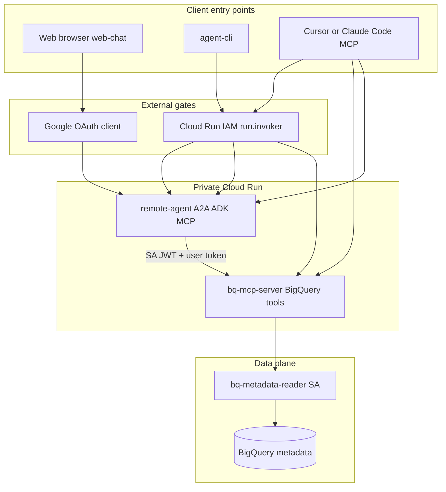
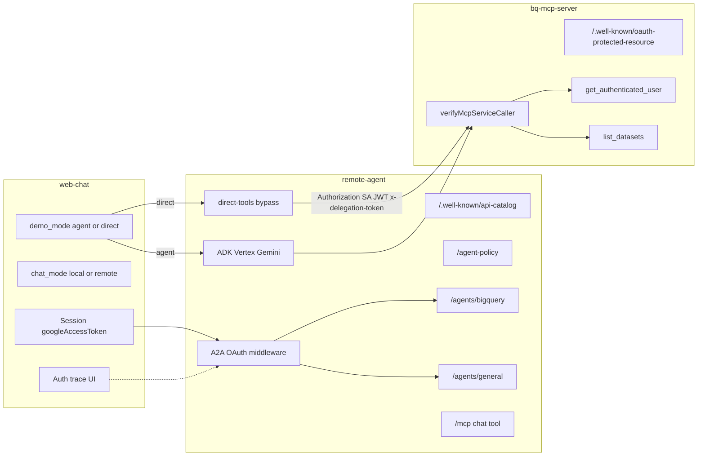
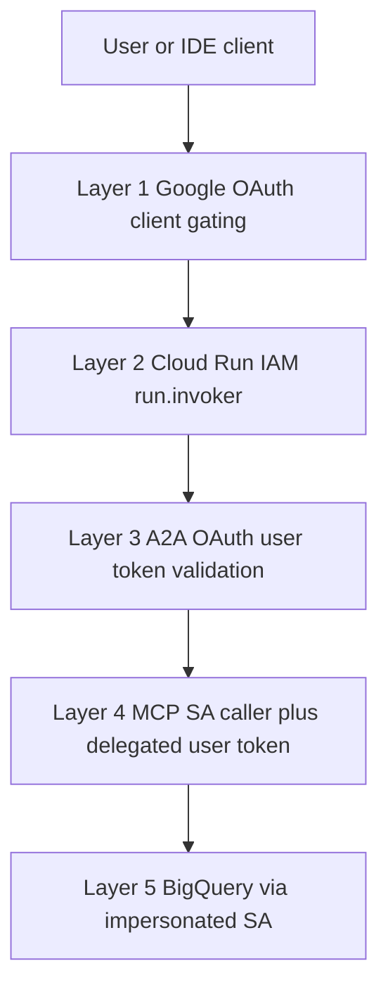
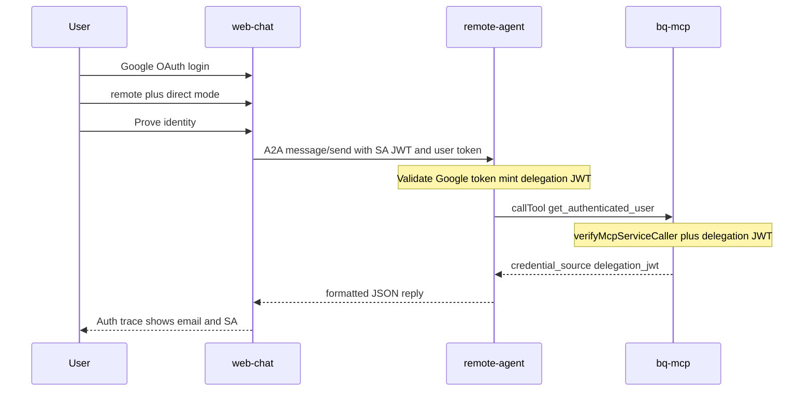
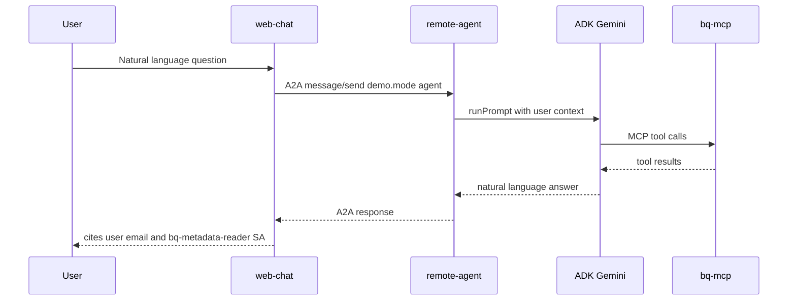
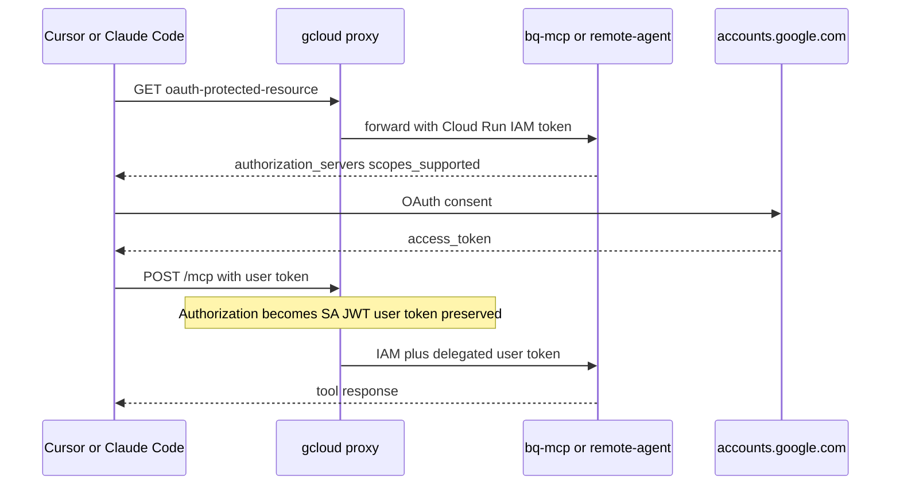
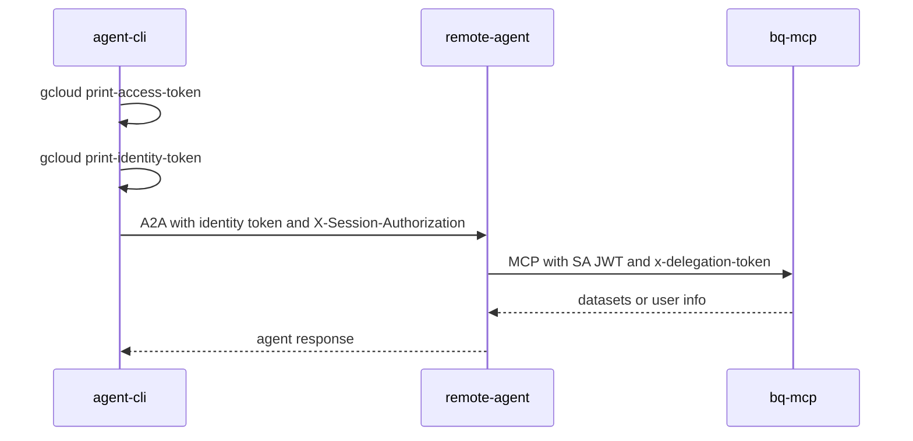

# Remote A2A Agent and MCP Server Integration — Proof Report

## Abstract

This report documents a working demonstration that chains a **private Cloud Run A2A agent** (`remote-agent`) to a **private BigQuery MCP server** (`bq-mcp-server`) while keeping **user identity** (Google OAuth access token) separate from **BigQuery data access** (impersonated `bq-metadata-reader` service account). The demo proves that multi-hop token delegation, layered security (OAuth client gating, Cloud Run IAM, application OAuth), and standard protocols (A2A, MCP OAuth PRM, RFC 9727 API catalog) compose into a reproducible, fail-closed architecture. Clients include a browser web chat, a CLI, and IDE MCP clients (Cursor, Claude Code).

---

## 1. Proof Claims

The demonstration validates the following hypotheses:

1. **A2A orchestration without direct MCP access** — A client can reach BigQuery MCP tools only through a remote A2A agent; the web chat never calls the MCP server directly.
2. **Identity separation from data access** — The user's OAuth access token proves _who_ the user is; BigQuery metadata reads use an impersonated service account (`bq-metadata-reader`), not the user's credentials sent to BigQuery APIs.
3. **Composable security layers** — Cloud Run IAM (`run.invoker`) and application-layer Google OAuth validation operate as independent gates; satisfying one does not bypass the other.
4. **Multi-hop token delegation** — User access tokens survive agent → MCP hops using explicit delegation headers distinct from Cloud Run identity JWTs.
5. **MCP OAuth discovery** — IDE clients discover authorization requirements via Protected Resource Metadata (PRM); Google requires pre-registered OAuth clients (no dynamic client registration).
6. **Multi-agent discovery** — Multiple A2A agents on one Cloud Run service are discoverable via RFC 9727 API catalog at `/.well-known/api-catalog`.
7. **Fail-closed behavior** — Negative tests confirm each layer rejects requests when required credentials are missing.

---

## 2. System Context

### 2.1 Components

| Component         | Role                                                                                                                            |
| ----------------- | ------------------------------------------------------------------------------------------------------------------------------- |
| **web-chat**      | Local Next.js chat UI. Performs browser Google OAuth, stores session + access token, sends A2A messages to `remote-agent`.      |
| **remote-agent**  | Cloud Run service hosting ADK agents, A2A JSON-RPC endpoints, optional MCP `/mcp` chat tool, and direct-tool bypass for proofs. |
| **bq-mcp-server** | Cloud Run MCP server exposing `get_authenticated_user` and `list_datasets` BigQuery tools.                                      |
| **mcp-auth**      | Shared library: OAuth middleware, MCP authorization handler, PRM routes, token delegation, Cloud Run identity token fetch.      |
| **agent-client**  | Shared A2A client: agent card resolution, API catalog discovery, dual-header Cloud Run fetch.                                   |
| **agent-cli**     | Command-line client sending A2A messages with gcloud-sourced tokens.                                                            |

### 2.2 Deployment Topology

**Cloud Run (production demo):**

- Both `remote-agent` and `bq-mcp-server` deploy as **private** Cloud Run services (`--no-allow-unauthenticated`).
- `allowed_emails` in Terraform configuration grants `roles/run.invoker` to designated users at deploy time.
- Web chat runs **locally** (not on Cloud Run); it uses Application Default Credentials to obtain Cloud Run identity tokens server-side.
- IDE MCP clients connect via **local gcloud proxies** on ports 8080 (MCP) and 8081 (agent) that inject Cloud Run IAM tokens.

**Local development:**

- All services run on localhost (`127.0.0.1:8080` MCP, `127.0.0.1:8081` agent, `localhost:3000` web chat).
- `AUTH_MODE=google`: user bearer token on `Authorization` without Cloud Run identity JWT.

### 2.3 Chain Rule

```text
web-chat → remote-agent (A2A) → bq-mcp-server (MCP)
```

The web chat **never** calls `bq-mcp-server` directly. IDE clients may connect to either endpoint, but the web-demo chain always goes through the agent.

---

## 3. Architecture Diagrams

### 3.1 Overview Architecture

High-level view: client entry points, external gates, private Cloud Run runtime, and BigQuery data plane.



### 3.2 Detailed System Diagram

Component-level view with routes, modes, and auth touchpoints.



### 3.3 Security Layers

Maps to the web-chat **Auth trace** strip (Session → IAM → A2A OAuth → MCP delegation → BigQuery SA).



---

## 4. Technology Primers

Each primer defines the standard, then describes how this demonstration applies it.

### 4.1 A2A (Agent-to-Agent Protocol)

The [Agent2Agent (A2A) Protocol](https://a2a-protocol.org/latest/specification/) is an open standard for communication between independent AI agent systems. A2A complements MCP: MCP connects an agent to tools and resources; A2A connects agents to each other for task delegation and collaboration. See the [A2A protocol overview](https://a2a-protocol.org/dev/) and the [Google Developers Blog announcement](https://developers.googleblog.com/en/a2a-a-new-era-of-agent-interoperability/).

Core concepts:

- **Agent Card** — JSON document describing an agent's capabilities, URL, and security requirements. Served at `{base}/agent-card.json` or legacy `/.well-known/agent-card.json`.
- **message/send** — JSON-RPC operation to send a user message and receive a response.
- **Protocol version** — This demo uses A2A **0.3.0** via the [`@a2a-js/sdk`](https://github.com/a2aproject/a2a-js) JavaScript SDK.

**How this demo applies it:**

- `remote-agent` hosts two agents: `bigquery` at `/agents/bigquery` and `general` at `/agents/general`.
- Agent cards declare OpenID Connect security with Google as the authorization server.
- Clients discover agents via `GET /.well-known/api-catalog` (RFC 9727) and fetch `{anchor}/agent-card.json`.
- The web chat and CLI call `A2AClient.fromCardUrl(...)` then `sendMessage` with optional metadata for demo modes.

### 4.2 A2A with OAuth (Application Layer)

A2A itself defines security schemes in the Agent Card (e.g., OpenID Connect). This demo adds an **application-layer OAuth gate** before A2A handlers execute: middleware validates a delegated Google **access token** on every protected route.

**How this demo applies it:**

- Middleware resolves the user token in order:
  1. `x-user-access-token` header
  2. `X-Session-Authorization: Bearer <token>` header (Cloud Run dual-header pattern)
  3. `Authorization: Bearer <token>` (local dev only; JWT-shaped identity tokens are excluded)
- Validation uses Google's token info endpoint to confirm the access token and extract the user email.
- Missing token → **401** `{ "error": "Missing Google access token" }`.
- Invalid token → **403** `{ "error": "Forbidden" }`.

Agent cards advertise Google OIDC; runtime enforcement is custom middleware, not A2A protocol OAuth inside JSON-RPC.

### 4.3 MCP (Model Context Protocol)

The [Model Context Protocol](https://modelcontextprotocol.io/specification/2025-06-18/basic) standardizes how AI applications connect to tools, resources, and prompts. MCP servers expose **tools** that clients invoke over HTTP (streamable HTTP transport in this demo).

**How this demo applies it:**

- `bq-mcp-server` registers two tools:
  - `get_authenticated_user` — returns identity from the delegated user token and which SA is used for BigQuery.
  - `list_datasets` — lists datasets in a GCP project using impersonated `bq-metadata-reader` credentials.
- `remote-agent` also exposes `/mcp` with a `chat` tool that orchestrates the ADK agent internally.
- `remote-agent` calls `bq-mcp-server` as an MCP **client** when executing direct tools or when the ADK agent invokes tools.

### 4.4 MCP with OAuth (Protected Resource Metadata)

[MCP Authorization](https://modelcontextprotocol.io/specification/2025-06-18/basic/authorization) requires servers to implement [RFC 9728 OAuth 2.0 Protected Resource Metadata](https://datatracker.ietf.org/doc/html/rfc9728). Clients discover which authorization servers and scopes are required before obtaining tokens.

PRM document fields used in this demo:

```json
{
  "resource": "https://example.run.app/mcp",
  "authorization_servers": ["https://accounts.google.com"],
  "scopes_supported": ["openid", "email", "https://www.googleapis.com/auth/bigquery"]
}
```

Served at `GET /.well-known/oauth-protected-resource`. When proxied locally, the resource URL reflects `http://127.0.0.1:8080/mcp` (loopback uses HTTP, not HTTPS).

**How this demo applies it:**

- Both MCP servers mount PRM routes via shared `mcp-auth` helpers.
- IDE clients (Cursor, Claude Code) fetch PRM, run Google OAuth, then send the access token on MCP requests.
- **Google does not support MCP Dynamic Client Registration.** Cursor requires a pre-registered Desktop OAuth client ID via environment variable. Claude Code can connect with URL and callback port only.

Cloud mode adds `verifyMcpServiceCaller`: the `Authorization` header must carry a valid Cloud Run **identity JWT** from an authorized caller (service account or user with `run.invoker`). On the agent path, user identity travels as a short-lived delegation JWT in `x-delegation-token`.

### 4.5 Token Delegation and Hop Token Exchange

**Client → agent (token delegation):** The user's Google OAuth access token is forwarded on `X-Session-Authorization` (Cloud Run) or `Authorization` (local) so `remote-agent` can validate identity via `getTokenInfo`.

**Agent → bq-mcp (hop token exchange):** After validating the Google token, `remote-agent` mints a short-lived HS256 **delegation JWT** (`iss=remote-agent`, `aud` = MCP origin, ~5 min TTL) and sends it on `x-delegation-token`. The raw Google access token is **not** forwarded on this hop when `DELEGATION_JWT_SECRET` is configured.

**IDE direct MCP (passthrough):** Clients that call `bq-mcp` without the agent still send the Google access token on `x-user-access-token` / `Authorization`.

Cloud Run requires a separate **identity JWT** on `Authorization` for private services, so this demo uses **dual headers**:

| Hop                                      | `Authorization`            | User identity header                                  |
| ---------------------------------------- | -------------------------- | ----------------------------------------------------- |
| Client → remote-agent (Cloud Run)        | Service identity JWT       | `X-Session-Authorization: Bearer <user_access_token>` |
| Client → remote-agent (local)            | User access token          | —                                                     |
| remote-agent → bq-mcp-server (Cloud Run) | Service identity JWT       | `x-delegation-token: Bearer <delegation_jwt>`         |
| IDE → gcloud proxy → MCP                 | Proxy replaces with SA JWT | User token preserved in `x-session-authorization`     |

**Principle:** Cloud Run IAM proves _who may reach the service_; the delegation JWT (or Google token on IDE path) proves _on behalf of which Google user_ the action runs. User OAuth tokens are **never** sent to BigQuery APIs directly.

This hop exchange is a **demo JWT pattern**, not [RFC 8693](https://datatracker.ietf.org/doc/html/rfc8693) OAuth Token Exchange.

### 4.6 Related Technologies

| Technology                        | Role in demo                                        | Reference                                                                                                                |
| --------------------------------- | --------------------------------------------------- | ------------------------------------------------------------------------------------------------------------------------ |
| **RFC 9727 API Catalog**          | Multi-agent discovery at `/.well-known/api-catalog` | [RFC 9727](https://www.rfc-editor.org/rfc/rfc9727.html), [RFC 9264 Linkset](https://www.rfc-editor.org/rfc/rfc9264.html) |
| **Google OAuth 2.0**              | Browser and IDE sign-in; token validation           | [OAuth 2.0](https://developers.google.com/identity/protocols/oauth2)                                                     |
| **Cloud Run IAM**                 | Private service invocation                          | [Service-to-service auth](https://cloud.google.com/run/docs/authenticating/service-to-service)                           |
| **Identity tokens**               | Cloud Run caller authentication                     | [Get ID token](https://cloud.google.com/docs/authentication/get-id-token)                                                |
| **Service account impersonation** | BigQuery metadata reads                             | [Short-lived credentials](https://cloud.google.com/iam/docs/create-short-lived-credentials-direct)                       |
| **Google ADK**                    | LLM agent orchestration in remote-agent             | [ADK documentation](https://google.github.io/adk-docs/)                                                                  |
| **Vertex AI / Gemini**            | Model backend (`gemini-2.5-flash` default)          | [Gemini API](https://ai.google.dev/gemini-api/docs)                                                                      |

---

## 5. Security Model

### 5.1 Layered Gates

Authorization — _who may use this demo_ — is enforced **outside** application code where possible:

| Layer                   | What it checks                                      | Where configured                              |
| ----------------------- | --------------------------------------------------- | --------------------------------------------- |
| **Google OAuth client** | Who may sign in (Internal app or test users)        | GCP Console → Credentials                     |
| **Cloud Run IAM**       | Who may invoke private service URLs (`run.invoker`) | Terraform `allowed_emails` → deploy scripts   |
| **Runtime A2A OAuth**   | Valid Google user access token                      | Application middleware on agent routes        |
| **Runtime MCP auth**    | Valid SA caller + delegated user token              | MCP authorized handler on bq-mcp-server       |
| **BigQuery access**     | Impersonated SA with `bigquery.metadataViewer`      | Terraform-provisioned `bq-metadata-reader` SA |

**Note on IAP:** Terraform may provision IAP OAuth brand/client for legacy setup. **Runtime protection in this demo is Cloud Run IAM + OAuth**, not per-hop IAP JWT validation.

### 5.2 Terminology

| Term               | Meaning in this demo                                                                                          |
| ------------------ | ------------------------------------------------------------------------------------------------------------- |
| **Google SSO**     | Browser OAuth to web-chat; runtime validation via Google token info at agent/MCP                              |
| **Cloud Run IAM**  | `allowed_emails` → `run.invoker` (network gate to private URLs)                                               |
| **A2A with OAuth** | User token on `X-Session-Authorization` (Cloud Run) or `Authorization` (local)                                |
| **MCP with OAuth** | PRM discovery + user identity at MCP; agent path uses hop token exchange; IDE direct path passes Google token |

### 5.3 MCP Tool Response Shapes (Proof Fields)

**get_authenticated_user** returns:

```json
{
  "email": "user@example.com",
  "credential_source": "delegation_jwt",
  "credential_issuer": "remote-agent",
  "credential_audience": "https://bq-mcp-xxx.run.app",
  "bigquery_credential_source": "impersonated_service_account",
  "bigquery_service_account": "bq-metadata-reader@PROJECT.iam.gserviceaccount.com",
  "auth_mode": "cloud"
}
```

IDE direct MCP calls may still return `"credential_source": "user_oauth_access_token"`.

**list_datasets** returns JSON including `status`, `bigquery_service_account`, and dataset list or error details.

---

## 6. End-to-End Flows (Sequence Diagrams)

### 6.1 Web — Direct Tool Identity Proof

Deterministic proof path bypassing the LLM. User clicks **Prove identity** in remote + direct mode.



A2A message metadata for direct mode:

```json
{
  "demo.mode": "direct",
  "demo.action": "prove_identity"
}
```

### 6.2 Web — Agent LLM Path

Natural-language path through ADK and Gemini.



Example prompt: _"What Google account am I using and what credentials access BigQuery?"_

### 6.3 IDE MCP via gcloud Proxy

Cursor or Claude Code connecting to local proxy URLs that forward to private Cloud Run.



Typical local proxy URLs:

- `http://127.0.0.1:8080/mcp` — direct BigQuery MCP tools
- `http://127.0.0.1:8081/mcp` — remote-agent chat tool (ADK orchestrates bq-mcp internally)

### 6.4 CLI Cloud Run Path

`agent-cli` with gcloud-sourced tokens calling A2A directly (no browser).



---

## 7. Proof Methodology

### 7.1 Web UI — Positive Proofs

The demo console uses a **control plane** (left) and **operation plane** (right). The operation plane shows an **Auth trace** strip after each request, labeling layers: Web session, Cloud Run IAM, A2A OAuth, MCP delegation.

**Prerequisites:** Web chat running locally on port 3000, signed in with Google, Cloud Run agent deployed and reachable.

| Step | UI settings            | Action                                                                      | Expected outcome                                                      |
| ---- | ---------------------- | --------------------------------------------------------------------------- | --------------------------------------------------------------------- |
| 1    | Default (local mode)   | Send any message                                                            | Reply from local web-chat agent; no remote-agent call                 |
| 2    | Remote + Agent via LLM | Ask: _What Google account am I using and what credentials access BigQuery?_ | Natural-language answer citing your email and `bq-metadata-reader` SA |
| 3    | Remote + Direct tool   | Click **Prove identity**                                                    | JSON with `"credential_source": "delegation_jwt"` and your email      |
| 4    | Remote + Direct tool   | Click **List datasets**                                                     | JSON with `status` and `bigquery_service_account` fields              |

Direct mode bypasses the LLM and returns raw bq-mcp JSON through remote-agent, proving delegation end-to-end without model nondeterminism.

**Auth profile toggles** (remote mode): apply to **Prove identity** and **List datasets**; full **Send** requires the Full profile. **Run probe** checks `GET /agent-policy` only.

### 7.2 Negative Proofs (curl)

Resolve the agent URL:

```bash
AGENT_URL="$(gcloud run services describe remote-agent \
  --project=YOUR_PROJECT --region=asia-northeast1 --format='value(status.url)')"
```

**Test 1 — No auth (Cloud Run IAM gate):**

```bash
curl -s -o /dev/null -w "%{http_code}\n" "${AGENT_URL}/.well-known/api-catalog"
```

Expected: **403** (caller lacks `run.invoker` / no identity token).

**Test 2 — IAM token only, no user OAuth (A2A OAuth layer):**

```bash
ID_TOKEN="$(gcloud auth print-identity-token --audiences="${AGENT_URL}")"
curl -s -o /dev/null -w "%{http_code}\n" \
  -H "Authorization: Bearer ${ID_TOKEN}" \
  "${AGENT_URL}/agent-policy"
```

Expected: **401** or **403** (missing delegated user access token).

**Test 3 — No web session (web-chat session gate):**

```bash
curl -s -o /dev/null -w "%{http_code}\n" \
  -X POST http://localhost:3000/api/chat \
  -H "Content-Type: application/json" \
  -d '{"message":"hello"}'
```

Expected: **401** (no session cookie).

### 7.3 Automated Regression

The cloud check script runs two agent-cli smoke tests against Cloud Run:

1. `List datasets in project YOUR_PROJECT`
2. `What Google account am I using and what credentials access BigQuery?`

Then verifies unauthenticated access to `/.well-known/api-catalog` does **not** return HTTP 200.

**Prerequisites:** `gcloud auth login`, `gcloud auth application-default login`, and `run.invoker` on remote-agent for the caller identity.

---

## 8. Results Matrix

| Test                         | Expected outcome           | What it proves                            |
| ---------------------------- | -------------------------- | ----------------------------------------- |
| Web local mode               | Local reply                | Remote stack not used                     |
| Web remote + agent           | LLM answer with user email | Full A2A + delegation chain               |
| Web remote + direct identity | JSON `delegation_jwt`      | Hop token exchange agent to bq-mcp-server |
| Web remote + direct datasets | JSON with SA field         | BigQuery impersonation path               |
| curl no auth                 | 403                        | Cloud Run IAM                             |
| curl IAM only                | 401/403                    | A2A OAuth middleware                      |
| curl no session              | 401                        | Web session gate                          |
| Automated cloud check        | Smokes pass + IAM negative | Regression coverage                       |

---

## 9. Multi-Agent Platform

### 9.1 Agents on One Cloud Run Service

`remote-agent` hosts multiple A2A agents under path prefixes:

| Agent ID   | Mount path         | Purpose                             |
| ---------- | ------------------ | ----------------------------------- |
| `bigquery` | `/agents/bigquery` | BigQuery assistant with MCP tools   |
| `general`  | `/agents/general`  | General chat without BigQuery tools |

Legacy BigQuery agent card remains at `/.well-known/agent-card.json` for backward compatibility.

### 9.2 API Catalog (RFC 9727)

`GET /.well-known/api-catalog` returns a Linkset document listing enabled agents:

```json
{
  "linkset": [
    {
      "anchor": "https://remote-agent-xxx.run.app/agents/bigquery",
      "describedby": [
        {
          "href": "https://remote-agent-xxx.run.app/agents/bigquery/agent-card.json",
          "type": "application/json",
          "title": "Agent Card for bigquery"
        }
      ]
    }
  ]
}
```

Clients fetch the catalog, then retrieve agent cards from `describedby` links.

### 9.3 Agent Policy

Runtime enable/disable without redeploy:

- `GET /agent-policy` — list agents and enabled status (requires OAuth).
- `PATCH /agent-policy` — `{ "agentId": "bigquery", "enabled": false }` (requires OAuth).

Policy is **in-memory only**; toggles reset when remote-agent restarts. Disabled agents return **404** on their routes.

### 9.4 Demo Modes (A2A Metadata)

| Metadata key     | Values                            | Effect                             |
| ---------------- | --------------------------------- | ---------------------------------- |
| `demo.mode`      | `agent` (default), `direct`       | LLM path vs direct MCP tool bypass |
| `demo.action`    | `prove_identity`, `list_datasets` | Required when `demo.mode=direct`   |
| `demo.projectId` | GCP project ID                    | Optional for `list_datasets`       |

Chat mode (`local` vs `remote`) is stored in an httpOnly cookie via `/api/chat-mode`, not in the A2A message body.

---

## 10. Limitations

1. **In-memory agent policy** — Runtime toggles do not persist across Cloud Run restarts.
2. **No IAP JWT per hop** — Protection is Cloud Run IAM + Google OAuth, not Identity-Aware Proxy JWT validation on each request.
3. **No MCP dynamic client registration with Google** — IDE clients need pre-registered Desktop OAuth client IDs.
4. **Web chat runs locally** — Not deployed to Cloud Run; server-side IAM uses developer Application Default Credentials.
5. **Demo scope** — BigQuery access is metadata-only (`list_datasets`); user tokens are not sent to BigQuery APIs.
6. **Single region** — Cloud Run services deploy to one region (e.g., `asia-northeast1`); no multi-region failover demo.
7. **Direct tool mode on bigquery agent only** — General agent does not support `demo.mode=direct`.
8. **Hop JWT exchange, not RFC 8693** — Agent→MCP uses a shared-secret delegation JWT for proof; not a standards-based OAuth Token Exchange or Google downscoped tokens.

---

## 11. References

External documentation and standards only.

### Protocols and Standards

- [A2A Protocol Specification](https://a2a-protocol.org/latest/specification/)
- [A2A Protocol Overview (A2A vs MCP)](https://a2a-protocol.org/dev/)
- [a2aproject/A2A (GitHub)](https://github.com/a2aproject/A2A)
- [@a2a-js/sdk (JavaScript SDK)](https://github.com/a2aproject/a2a-js)
- [Model Context Protocol Specification](https://modelcontextprotocol.io/specification/2025-06-18/basic)
- [MCP Authorization](https://modelcontextprotocol.io/specification/2025-06-18/basic/authorization)
- [RFC 9727 — api-catalog Well-Known URI](https://www.rfc-editor.org/rfc/rfc9727.html)
- [RFC 9264 — Linkset Format](https://www.rfc-editor.org/rfc/rfc9264.html)
- [RFC 9728 — OAuth 2.0 Protected Resource Metadata](https://datatracker.ietf.org/doc/html/rfc9728)
- [RFC 8414 — OAuth 2.0 Authorization Server Metadata](https://datatracker.ietf.org/doc/html/rfc8414)

### Google Cloud and Identity

- [Using OAuth 2.0 to Access Google APIs](https://developers.google.com/identity/protocols/oauth2)
- [OpenID Connect](https://developers.google.com/identity/openid-connect/openid-connect)
- [OAuth 2.0 Scopes for Google APIs (BigQuery)](https://developers.google.com/identity/protocols/oauth2/scopes#bigquery)
- [Cloud Run — Authenticating service-to-service](https://cloud.google.com/run/docs/authenticating/service-to-service)
- [Get Google ID tokens](https://cloud.google.com/docs/authentication/get-id-token)
- [Creating short-lived service account credentials](https://cloud.google.com/iam/docs/create-short-lived-credentials-direct)
- [Gemini API Documentation](https://ai.google.dev/gemini-api/docs)

### Agent Frameworks

- [Google Agent Development Kit (ADK)](https://google.github.io/adk-docs/)
- [Announcing the Agent2Agent Protocol — Google Developers Blog](https://developers.googleblog.com/en/a2a-a-new-era-of-agent-interoperability/)
